# Private Investment Butler 技术架构文档

更新时间：2026-06-21

## 1. 总体架构

系统采用本地优先、纯 Python、手写编排。主对话管道和定时任务管道并列存在，共享策略岛、数据 Provider、LLM 网关、通讯网关和观测系统。

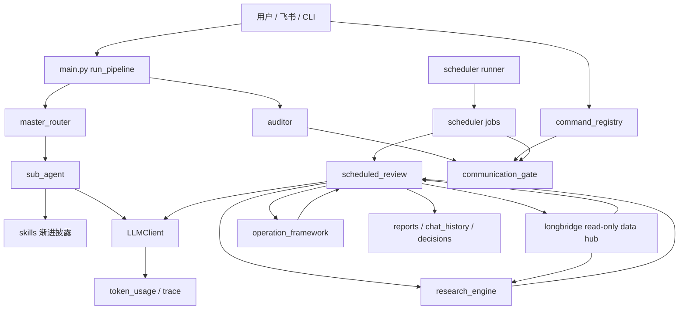

主对话管道用于自然语言投资问答；定时任务管道用于固定时间点自动复盘和推送。

## 2. 模块分层

| 层级 | 模块 | 职责 |
| --- | --- | --- |
| 入口层 | `main.py` | 自然语言管道入口 |
| 飞书层 | `src/feishu_long_connection.py`, `src/feishu_runtime.py` | 飞书长连接和消息处理 |
| 命令层 | `src/command_registry.py` | slash command 解析和分发 |
| 调度层 | `src/scheduler/config.py`, `src/scheduler/runner.py`, `src/scheduler/jobs.py` | 定时任务配置、判定和执行 |
| 定时健康检查层 | `src/scheduled_health.py` | 只读汇总 scheduler 运行日志和报告质量 |
| 交易日历层 | `src/trading_calendar.py` | 本地交易日历缓存、美股规则、A 股刷新入口 |
| 自动化复盘层 | `src/scheduled_review.py` | 开盘计划、收盘复盘、周复盘 |
| 投研层 | `src/research_engine.py` | Growth Theme Radar、Industry Mapper、Research Signal、Deep Research 队列 |
| 操作框架层 | `src/action_permission.py`, `src/operation_plan.py` | Action Permission 准入和 Operation Plan 备忘录 |
| 策略数据层 | `src/portfolio_ledger.py`, `src/cash_anchor_watchlist.py`, `src/growth_portfolio.py` | 本地账本和遗留快照 |
| 长桥只读数据平台层 | `src/longbridge_provider.py`, `src/growth_universe.py`，后续拆分 `longbridge_*` providers | 券商账户、行情、基本面、资讯、期权和交易查询的只读接入 |
| 外部情报层 | `src/market_data/*`, `src/market_intel.py` | 行情、新闻、公告 |
| 知识层 | `src/research_dossier.py`, `src/knowledge_absorber.py` | 研究档案和宪法补丁 |
| 模型层 | `src/llm_client.py`, `src/prompts.py`, `prompts/*` | 统一 LLM 调用和 prompt 模板 |
| 审计观测层 | `src/auditor.py`, `src/context_logger.py`, `src/decision_record.py`, `src/trace_logger.py`, `src/token_monitor.py` | 审计、归档、trace、token |
| 通讯层 | `src/communication_gate.py` | 用户可见输出统一出口 |

## 3. 策略岛目录

```text
frameworks/
├── Cash_Anchor/
│   ├── constitution.md
│   ├── sub_frameworks/
│   │   ├── CN_Dividend_Income.md
│   │   └── US_Income_Options.md
│   ├── data/
│   │   ├── holdings.csv
│   │   ├── cash_watchlist.csv
│   │   ├── capital_flows.csv
│   │   ├── portfolio_events.csv
│   │   └── dividend_plan.yaml
│   ├── reports/
│   ├── research_dossiers/
│   └── chat_history/
└── Growth_Engine/
    ├── constitution.md
    ├── sub_frameworks/
    │   └── US_Disruptive_Growth.md
    ├── data/
    │   ├── growth_holdings.csv
    │   └── growth_watchlist.csv
    ├── reports/
    ├── research_dossiers/
    └── chat_history/
```

`Growth_Engine/data/*` 目前只保留遗留快照兼容，不作为正式自动化标的来源。正式来源是长桥 universe。

## 4. 自然语言主管道

入口：`main.py::run_pipeline(user_input, chat_id)`

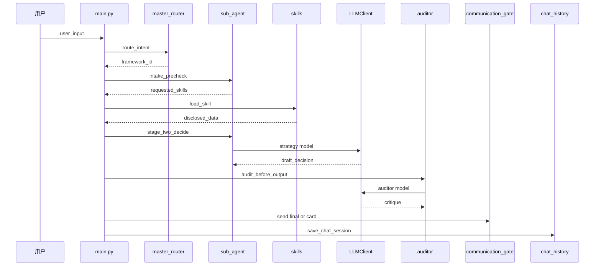

关键约束：

- 只路由到一个策略岛。
- Worker 每次只读取本策略岛宪法和必要子框架。
- Growth Worker 只加载 `US_Disruptive_Growth`。
- 所有 Skill 渐进披露。
- 审计官独立模型调用。
- `[REJECT]` 会触发人工确认卡片。

## 5. 定时任务架构

配置来源：`config.yaml::scheduler.jobs`

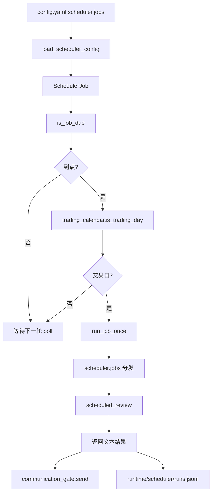

正式任务：

| job_type | framework_id | market | workflow_type |
| --- | --- | --- | --- |
| `cash_anchor_cn_premarket_review` | Cash_Anchor | CN | premarket |
| `cash_anchor_cn_close_review` | Cash_Anchor | CN | close |
| `cash_anchor_us_premarket_review` | Cash_Anchor | US | premarket |
| `growth_us_premarket_review` | Growth_Engine | US | premarket |
| `cash_anchor_us_close_review` | Cash_Anchor | US | close |
| `growth_us_close_review` | Growth_Engine | US | close |
| `cash_anchor_weekly_review` | Cash_Anchor | ALL | weekly |
| `growth_weekly_review` | Growth_Engine | ALL | weekly |

`run_job_once` 在执行前申请 job 级别本地文件锁：

```text
runtime/scheduler/locks/{job_name}.lock
```

重复触发会返回“已跳过重复触发”，并写入 `runtime/scheduler/runs.jsonl`。

健康检查模块：

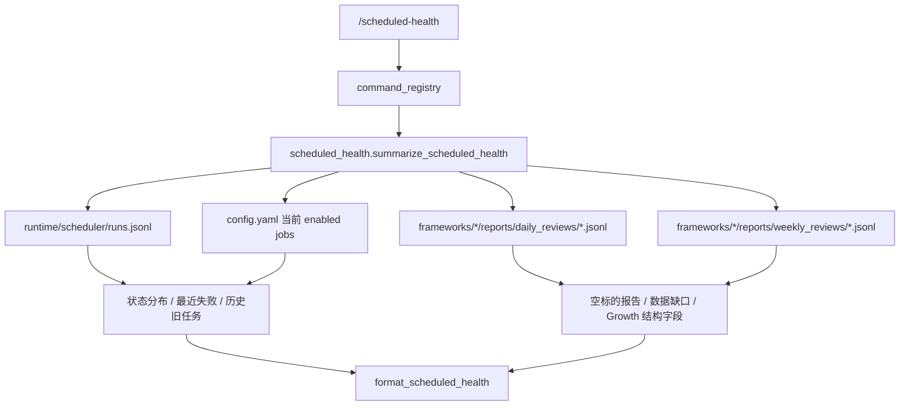

该路径只读本地文件，不调用模型、不触发长桥、不修改报告。它主要用于运行观察阶段快速判断：

- scheduler 是否记录 error。
- 是否仍有当前配置外的历史任务名，例如旧的 A 股成长任务。
- Growth 报告是否因为长桥读取失败出现 `tracked_symbol_count=0`。
- Growth 新报告是否带有 `context.research_engine` 和 `context.operation_framework`。

## 6. 长桥只读数据平台

当前实现只接入了长桥 CLI 的持仓、自选、报价、现金流水、分红历史和汇率能力。后续设计升级为 Longbridge Read-only Data Hub，把长桥作为美股侧优先事实源，但所有交易写操作保持禁用。

参考入口：

- `https://open.longbridge.com/zh-CN/docs`
- `https://open.longbridge.com/zh-CN/docs/cli`

目标结构：

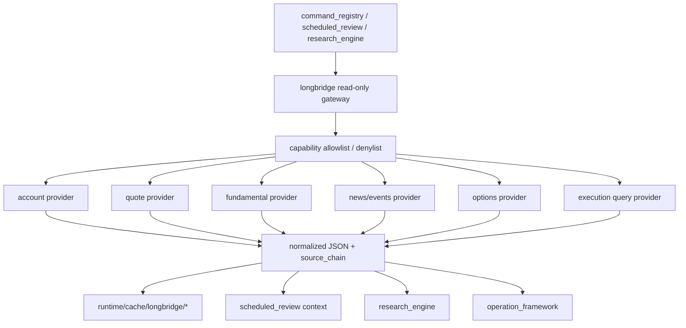

能力分层：

| 层 | 允许能力 | 禁止能力 |
| --- | --- | --- |
| Account Read | 账户资产、现金、持仓、资金流水、分红到账、汇率 | 资金划转、融资操作、任何改变账户状态的动作 |
| Quote Read | 实时报价、K 线、盘前盘后、市场状态、交易日历、涨跌幅排行 | 无 |
| Fundamental Read | 公司资料、财报、估值、盈利、分红、行业组件、行业估值 | 自动改写研究档案和宪法 |
| News/Event Read | 新闻、公告、公司事件、财报日历、分红日历 | 自动订阅、自动反写券商提醒 |
| Options Read | 期权链、到期日、希腊值、隐含波动、底层映射 | 期权下单、组合下单、自动行权决策 |
| Execution Query | 历史订单、历史成交、委托状态、成交均价 | 下单、改单、撤单、条件单、定投单 |

实现约束：

- 所有长桥调用必须由固定 Python 函数发起，函数名和用途进入 allowlist。
- allowlist 中只放查询能力；denylist 显式覆盖下单、改单、撤单、条件单、定投单等交易写操作。
- LLM 只接收结构化结果，不接收长桥密钥、SDK client 或 shell 权限。
- 返回值必须包含 `source`、`provider`、`as_of`、`freshness`、`source_chain`、`warnings`、`cache`。
- 长桥失败时返回结构化错误并进入数据缺口，不把过期缓存当成当前事实。
- 缓存按数据域设置 TTL：行情分钟级，账户和成交日内级，基本面和公司资料日级。

建议模块拆分：

| 模块 | 状态 | 职责 |
| --- | --- | --- |
| `src/longbridge_provider.py` | 已有 | 当前 CLI 白名单执行、解析和 Cash/Growth 基础同步 |
| `src/longbridge_capabilities.py` | 已实现 | 只读 allowlist 和交易写 denylist |
| `src/longbridge_health.py` | 已实现 | 检查 CLI、日志目录、OpenAPI 网络和只读基础命令 |
| `src/longbridge_account_provider.py` | 已实现 | 账户资产、组合总览、历史订单和历史成交只读查询；已接入 scheduled_review context |
| `src/longbridge_quote_provider.py` | 待实现 | 行情、K 线、市场状态、交易日历 |
| `src/longbridge_fundamental_provider.py` | 待实现 | 公司资料、财报、估值、分红、行业数据 |
| `src/longbridge_event_provider.py` | 待实现 | 新闻、公告、公司事件、财报和分红日历 |
| `src/longbridge_options_provider.py` | 待实现 | 期权链、到期日、希腊值、隐含波动、底层映射 |

## 7. Growth Universe

核心模块：`src/growth_universe.py`

输入：

- `src.longbridge_provider.sync_longbridge_growth_positions()`
- `src.longbridge_provider.sync_longbridge_watchlist()`

输出：

- `scope=growth_engine_us_universe`
- `universe`
- `excluded`
- `summary`
- `write_policy=read_only_context`

归一化规则：

| 规则 | 结果 |
| --- | --- |
| 长桥持仓 | 进入候选源 |
| 长桥自选 | 进入候选源 |
| Cash Anchor 固定现金流标的 | 排除 |
| 美股期权合约 | 合约排除，底层股票入候选 |
| 2x/3x 杠杆 ETF | 排除 |
| 普通 ETF | 可以入池 |
| 指数代码 | 排除 |
| 重复标的 | 合并 source、group、持仓状态 |
| 配置 blocklist | 强制按 `leveraged_etf` 排除 |
| 配置 allowlist | 避免普通 ETF 被杠杆 ETF 规则误杀 |
| 特殊 ETF | 写入 `asset_subtype` 和 `classification_tags` |

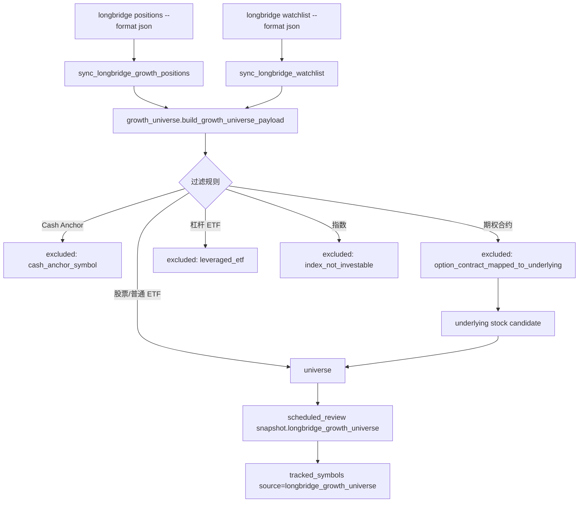

查看命令：

```text
/growth-universe
/growth-universe refresh=true
/sync longbridge growth
```

配置项：

```yaml
growth_universe:
  cache_enabled: true
  cache_ttl_seconds: 900
  leveraged_etf_blocklist: "CONL,..."
  leveraged_etf_allowlist: ""
  ordinary_etf_allowlist: "DRAM,SPCX"
  special_etf_classifications: "SPCX:spac_new_issue_etf:..."
```

缓存：

```text
runtime/cache/growth_universe.json
```

`/growth-universe` 和定时任务默认读取缓存；`/growth-universe refresh=true` 与 `/sync longbridge growth` 强制刷新。

`universe` 单项新增分类字段：

| 字段 | 含义 |
| --- | --- |
| `asset_subtype` | `common_stock`、`ordinary_etf`、`option_underlying_stock`、`spac_new_issue_etf` 等 |
| `classification_tags` | `common_stock`、`ordinary_etf`、`special_etf`、`option_underlying`、`ordinary_etf_allowlist` 等 |

### 7.1 Growth Research Engine

核心模块：`src/research_engine.py`

Research Engine 是 Growth Engine 的只读投研上游，目标是把 universe、新闻公告和研究档案转成结构化投研信号，再交给 `scheduled_review` 生成操作建议。

输入：

- `growth_universe` 的 `universe` 和 `summary`。
- `symbol_intel` 中的新闻和公告。
- `research_dossiers` 中的研究档案摘要和 freshness。
- 可选 `market_data` 和长桥成本/现价。

输出：

| 对象 | 字段/含义 |
| --- | --- |
| `theme_radar` | 主题、信号数量、持仓数量、观察数量、假设影响、证据强度 |
| `industry_mapper` | 主题对应的产业链、利润池、相关标的、验证指标 |
| `research_signals` | ticker、theme、thesis_impact、valuation_view、confidence、risk_level、evidence_strength、suggested_status |
| `deep_research_queue` | 需要新建档案、刷新档案、风险复核或 thesis 更新的标的 |

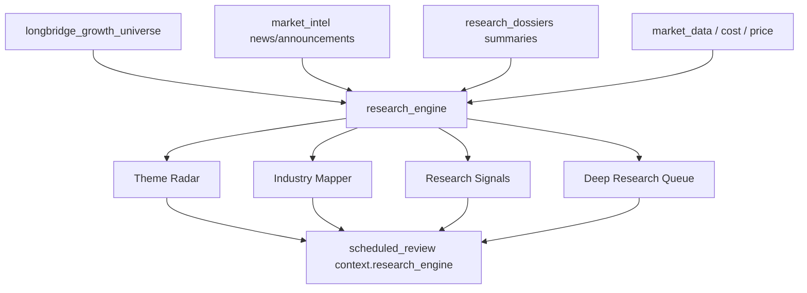

边界：

- 不调用交易接口。
- 不修改研究档案。
- 不修改 `constitution.md`。
- 不把 strengthened 信号直接转成买入建议。

查看命令：

```text
/research-radar [limit=<n>]
```

### 7.2 Operation Framework

核心模块：

- `src/action_permission.py`
- `src/operation_plan.py`

Operation Framework 是投研信号和用户可见操作建议之间的约束层。它不判断企业价值，而是判断当前是否允许形成操作计划，以及计划应该停留在哪个动作状态。

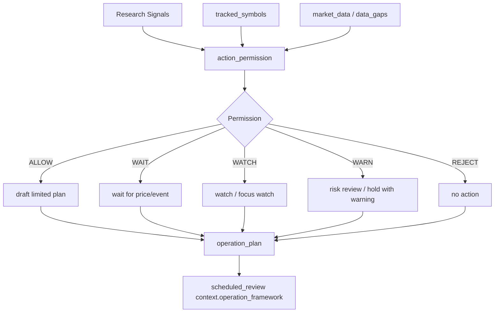

`Action Permission` 输出：

| 字段 | 含义 |
| --- | --- |
| `permission_result` | `ALLOW`、`WAIT`、`WATCH`、`WARN`、`REJECT` |
| `permission_scope` | 允许生成的计划范围 |
| `reasons` | 准入理由 |
| `constraints` | 计划约束 |
| `blockers` | 阻断原因 |
| `risk_flags` | 风险标签 |

`Operation Plan` 输出：

| 字段 | 含义 |
| --- | --- |
| `action` | `watch`、`focus_watch`、`wait_for_price_or_event`、`hold_review`、`add_plan_candidate`、`buy_zone_candidate`、`trim_review`、`risk_review_hold`、`no_action` |
| `final_status` | `memo_only`、`waiting`、`wait_for_user_approval`、`blocked` |
| `execution_conditions` | 后续允许执行前必须满足的条件 |
| `stop_review_conditions` | 需要停止、减仓或退出审查的条件 |

边界：

- 只生成备忘录，不交易。
- `ALLOW` 也只是允许生成计划，不是自动执行。
- `WARN/REJECT/WATCH/WAIT` 不能被 prompt 改写成直接买入或加仓。

查看命令：

```text
/operation-plan [limit=<n>]
```

## 8. 自动化复盘上下文

核心模块：`src/scheduled_review.py`

### 8.1 日报上下文

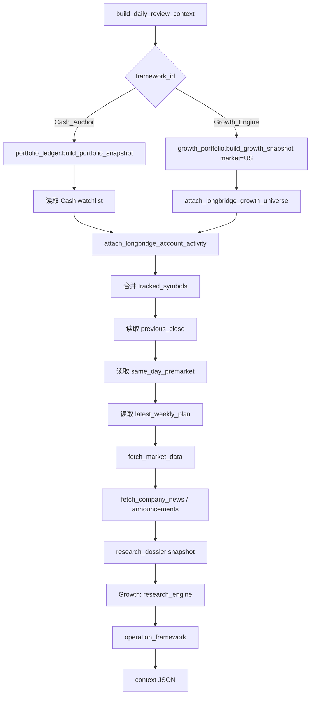

`tracked_symbols` 来源：

- Cash Anchor：本地持仓、本地自选、长桥 Cash Anchor 美股自选。
- Growth Engine：`longbridge_growth_universe`。

US 日报上下文会额外写入 `context.account_activity`，来源是 `longbridge_account_provider.build_account_activity_snapshot(days=7)`。该字段只保留压缩后的账户资产、组合摘要、历史订单和历史成交预览；读取失败时进入 `data_gaps`，不阻断报告生成。

### 8.2 周报上下文

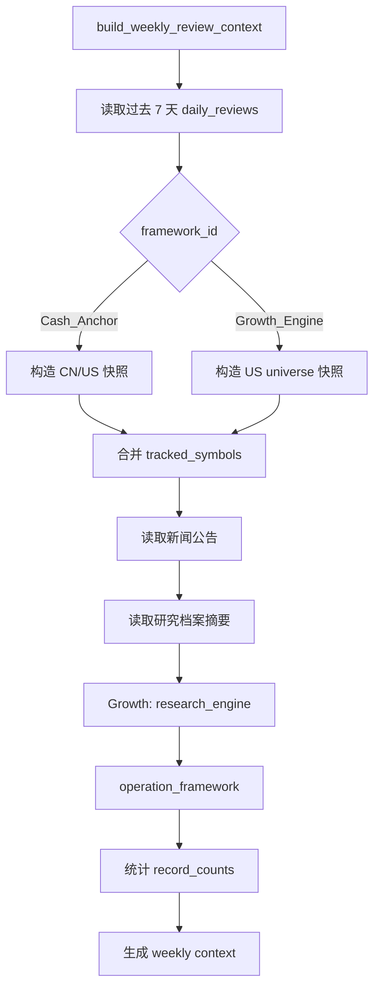

Growth 周报只要求 US 日报记录；Cash 周报要求 CN 和 US 覆盖。

## 9. LLM 调用链路

所有自动化复盘模型调用都在 `src/scheduled_review.py::_run_scheduled_review_llm` 中完成。

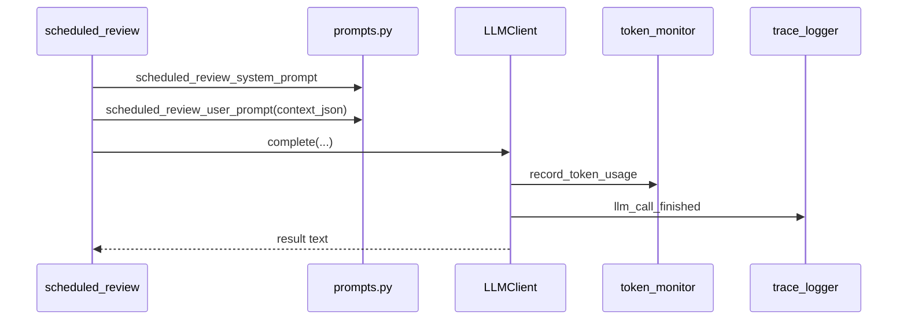

预算桶：

- `config.yaml::budgets.workflows.scheduled_review`
- `src/budget_manager.py::workflow_for_call_site`

## 10. 记录格式

自动化复盘记录写入：

```text
frameworks/{framework_id}/reports/daily_reviews/YYYY-MM-DD.jsonl
frameworks/{framework_id}/reports/weekly_reviews/YYYY-MM-DD.jsonl
```

单条记录核心字段：

```json
{
  "schema_version": 1,
  "record_id": "scheduled_20260615_xxxxxx",
  "created_at": "2026-06-15T20:00:00",
  "review_date": "2026-06-15",
  "trace_id": "trace_scheduled_xxxxxx",
  "chat_id": "oc_xxx",
  "framework_id": "Growth_Engine",
  "context_bundle_id": "US_Disruptive_Growth",
  "market": "US",
  "workflow_type": "close",
  "status": "ok",
  "tracked_symbol_count": 3,
  "context": {},
  "result": "..."
}
```

写入后同步归档：

- `frameworks/{framework_id}/chat_history/YYYY-MM-DD.jsonl`
- `runtime/decisions/YYYY-MM-DD.jsonl`
- `runtime/traces/YYYY-MM-DD.jsonl`
- `runtime/token_usage/YYYY-MM-DD.jsonl`

## 11. 外部数据边界

| 能力 | 模块 | 边界 |
| --- | --- | --- |
| 行情 | `src/market_data/provider_router.py` | 只读，失败返回结构化错误 |
| 新闻 | `src/market_intel.py::fetch_company_news` | 免费源，可能为空 |
| 公告 | `src/market_intel.py::fetch_company_announcements` | 免费源，可能为空 |
| 长桥账户数据 | `src/longbridge_provider.py`, `src/longbridge_account_provider.py` | 只读读取资产、持仓、现金、资金流水、历史订单和成交 |
| 长桥行情数据 | 后续 `src/longbridge_quote_provider.py` | 只读读取报价、K 线、市场状态、交易日历和排行 |
| 长桥基本面数据 | 后续 `src/longbridge_fundamental_provider.py` | 只读读取公司资料、财报、估值、分红和行业数据 |
| 长桥资讯事件 | 后续 `src/longbridge_event_provider.py` | 只读读取新闻、公告、公司事件、财报日历和分红日历 |
| 长桥期权数据 | 后续 `src/longbridge_options_provider.py` | 只读读取期权链、到期日、希腊值和隐含波动 |
| 长桥交易写操作 | 禁用清单 | 下单、改单、撤单、条件单、定投单永久禁止自动调用 |
| Growth universe | `src/growth_universe.py` | 归一化和过滤，不写本地账本 |
| Growth universe 缓存 | `runtime/cache/growth_universe.json` | TTL 内复用，手动 sync 强制刷新 |
| Growth Research Engine | `src/research_engine.py` | 只读聚合投研信号，不写账本和档案 |
| Operation Framework | `src/action_permission.py`, `src/operation_plan.py` | 只读生成准入和操作备忘录 |
| 研究档案 | `src/research_dossier.py` | 本地 JSON，不自动覆盖判断 |

LLM 不允许直接调用 shell、券商 CLI、SDK client 或外部 API。所有外部数据必须通过固定 Python 函数进入。

## 12. 通讯和推送

用户可见输出统一经过：

```python
communication_gate.send(chat_id, text)
communication_gate.send_card(chat_id, title, text, actions)
```

定时任务路径：

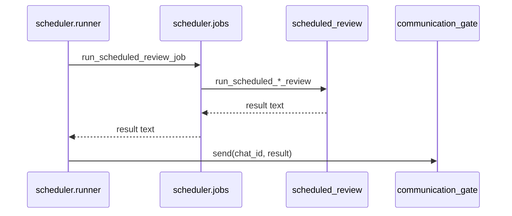

手动 slash command 路径：

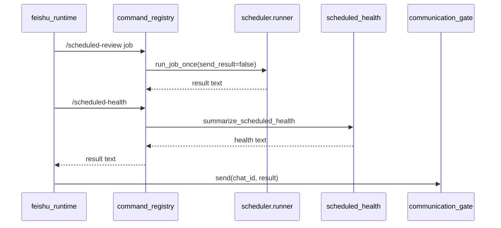

## 13. 运行和验证

查看任务：

```bash
python3 scripts/run_scheduler.py --list
```

试运行：

```bash
python3 scripts/run_scheduler.py --run-once growth_us_close_review
```

正式执行：

```bash
python3 scripts/run_scheduler.py --run-once growth_us_close_review --execute
```

查看长桥健康：

```text
/longbridge-health
/longbridge-health timeout=15
/longbridge-health cli=false network=false
```

查看长桥账户/成交只读快照：

```text
/longbridge-account
/longbridge-account days=7
/longbridge-account symbol=NVDA.US start=2026-06-01 end=2026-06-21
```

查看 Growth universe：

```text
/growth-universe
/growth-universe refresh=true
/research-radar
/operation-plan
```

查看定时任务健康：

```text
/scheduled-health
/scheduled-health limit=3
```

本地测试：

```bash
python3 -m compileall src tests scripts
python3 -m unittest
```
