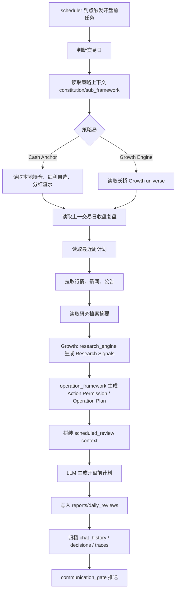
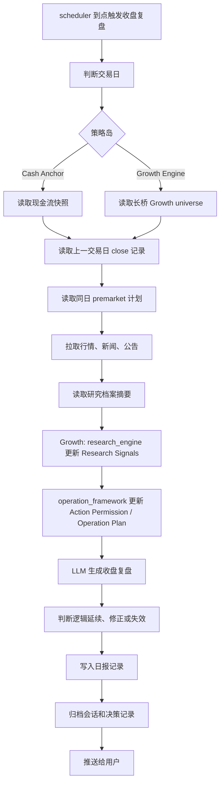
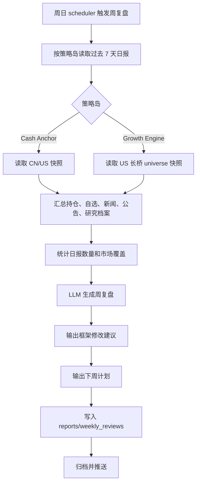
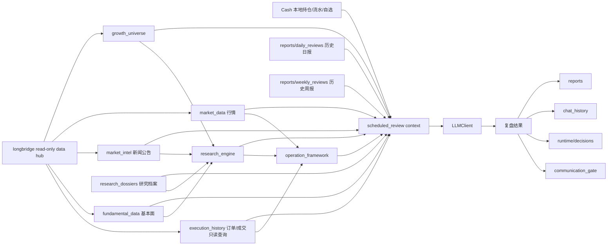

# Private Investment Butler 需求分析文档

更新时间：2026-06-21

## 1. 项目目标

本项目是本地优先的私人投资管家，用于把用户的投资宪法、持仓、自选股、券商只读数据、研究档案、新闻公告和每日/每周复盘连接成持续运行的工作流。

系统不自动交易，不自动下单，不自动改写投资宪法。它的目标是在每个交易日固定时间生成结构化分析、操作建议、风险提示和后续计划，并把每次判断保存下来，供下一次复盘继续引用。

当前策略范围：

1. `Cash_Anchor`：防守端，覆盖 A 股红利、美股美元现金流、分红到账、现金流目标和仓位纪律。
2. `Growth_Engine`：进攻端，只覆盖美股成长，标的来源完全来自长桥持仓和长桥自选。
3. 周期化复盘：开盘前计划、收盘后复盘、周日周复盘必须形成连续判断链。
4. 投研分层：Growth Engine 在操作建议前先生成 Theme Radar、Industry Mapper、Research Signal 和 Deep Research 队列。
5. 本地留痕：自动化输出写入 `reports/`，并归档到 `chat_history/`、`runtime/decisions/`、`runtime/traces/`。
6. 输出边界：只给建议和待确认事项；涉及框架修改时只提出建议，不直接修改 `constitution.md`。

## 2. 用户和核心场景

主要用户是单人本地部署的个人投资者。

核心场景：

1. 每个 A 股交易日开盘前，针对 A 股红利持仓和自选股生成当日计划。
2. 每个 A 股交易日收盘后，针对 A 股红利持仓和自选股生成复盘，并引用上一交易日记录。
3. 每个美股交易日开盘前，针对美股现金流标的和美股成长 universe 生成当日计划。
4. 每个美股交易日收盘后，针对美股现金流标的和美股成长 universe 生成复盘，并引用上一交易日记录。
5. 每周日晚上，按策略岛分别汇总过去一周日报，给出框架修改建议和下周计划。
6. 用户可用 slash command 手动查看持仓、长桥同步结果、Growth universe、研究档案、定时任务和任务健康检查。
7. 用户可用 `/absorb` 把外部知识转成宪法补丁提案，人工确认后才进入框架。

## 3. 策略范围

### 3.1 Cash Anchor

关注对象：

- A 股红利持仓。
- A 股红利自选股。
- 美股美元现金流资产，例如 QQQI、XQQI、TQQQ。
- 分红到账流水。
- 年度工资投入。
- 仓位上限、行业上限、核心/普通/周期红利分类。

核心判断：

- 分红是否安全，是否来自正式披露、到账流水或人工账本。
- 股息率、自由现金流、派息率和分红覆盖率是否支持继续持有。
- 仓位是否超限，是否允许加仓。
- 持仓应持有、加仓、减仓、等待还是禁动。
- 是否需要刷新研究档案或进入框架审议。

### 3.2 Growth Engine

关注对象：

- 美股成长持仓。
- 美股成长自选股。
- 普通美股 ETF。
- 研究档案中的增长逻辑、估值、风险点和退出条件。

标的来源规则：

1. Growth universe 完全来自长桥，不维护手工自选作为正式来源。
2. 长桥持仓和长桥自选会合并为同一个 `growth_engine_us_universe`。
3. `QQQI`、`XQQI`、`TQQQ` 及其 `.US` 形式归 `Cash_Anchor/US_Income_Options`，不进入 Growth。
4. 期权合约不进入 universe，只映射到底层股票。
5. 2x/3x 杠杆 ETF 不进入 universe。
6. 普通 ETF 可以进入 universe。
7. 指数代码不进入 universe。
8. 长桥读取失败时，自动化任务记录数据缺口，不使用本地手工名单回退。
9. 杠杆 ETF blocklist、allowlist、普通 ETF allowlist 和特殊 ETF 分类通过 `config.yaml::growth_universe` 配置。
10. Growth universe 默认使用本地缓存，减少同一轮定时任务重复读取长桥。

核心判断：

- 成长逻辑是否延续。
- 护城河、TAM、EPS/FCF、估值消化和流动性是否支持继续持有。
- 财报、新闻、公告是否改变原始买入逻辑。
- 投研信号是 strengthened、weakened、needs_refresh 还是 insufficient_evidence。
- 持仓是否继续持有、加仓、减仓、禁动或退出观察。
- 自选股是否进入重点观察，还是等待触发条件。

### 3.3 Growth Research Engine MVP

Growth Engine 增加只读投研层，用于把“新闻/公告/研究档案/universe”先转成结构化投研信号，再进入操作建议。

输入：

- 长桥 Growth universe。
- `market_intel` 新闻和公告。
- `research_dossiers` 研究档案摘要。
- 已有行情和成本信息。

输出：

- `Theme Radar`：识别 AI 算力、AI 软件、半导体、云安全、加密金融科技、生物科技等主题变化。
- `Industry Mapper`：把主题映射到产业链位置、利润池和验证指标。
- `Research Signal`：按标的输出主题、假设影响、估值视图、证据强度、风险等级、建议状态和后续验证点。
- `Deep Research Queue`：提示哪些标的需要新建档案、刷新档案、风险复核或 thesis 更新。

边界：

- 不下单。
- 不自动修改研究档案。
- 不自动修改 `constitution.md`。
- 不把投研增强直接等同于买入建议。

### 3.4 Operation Framework MVP

系统在定时复盘上下文中增加操作框架层，用于把投研信号和策略约束转成稳定的操作备忘录。

输入：

- `Research Signal`。
- 策略岛和市场。
- 持仓/自选来源。
- 行情、数据缺口和研究档案状态。
- Cash Anchor 的分红安全、现金流、仓位和估值约束。

输出：

- `Action Permission`：`ALLOW`、`WAIT`、`WATCH`、`WARN`、`REJECT`。
- `Operation Plan`：`watch`、`focus_watch`、`wait_for_price_or_event`、`hold_review`、`add_plan_candidate`、`buy_zone_candidate`、`trim_review`、`risk_review_hold`、`no_action`。

核心规则：

- `REJECT/WARN/WATCH/WAIT` 不能被写成直接买入或加仓。
- `ALLOW` 只允许生成计划，不代表系统已经执行。
- 买入、加仓、减仓、退出类计划必须等待用户确认。
- Growth 自选股没有通过 Action Permission 前，只能进入观察、重点观察、买入观察区或禁动。

### 3.5 长桥只读数据平台

现有长桥接入不能只停留在持仓、自选和分红同步。长桥开放平台提供行情、基本面、账户资产、交易查询、期权、日历、资讯和 CLI/SDK 等能力，本系统应把长桥升级为主要外部事实源，但必须坚持“不让系统自行下单”的底线。

接入原则：

1. 长桥作为优先级最高的美股事实源，覆盖持仓、自选、行情、交易日历、资讯、基本面、期权链、资金流水和历史成交查询。
2. 所有长桥能力必须经过固定 Python Provider，不允许 LLM 自由调用 shell、拼接命令或直接访问 SDK/API。
3. 长桥交易类写操作永久禁用，包括下单、改单、撤单、条件单、定投单和任何会改变账户委托状态的接口。
4. 允许使用交易域里的只读查询能力，例如资产、持仓、订单历史、成交历史、资金流水和保证金状态。
5. 长桥读取失败时必须记录数据缺口、保留 source_chain，不允许把旧缓存伪装成当前事实。
6. 缓存可以用于降低频繁访问，但必须标注 `as_of`、`source`、`ttl_seconds` 和是否命中缓存。

优先接入的数据域：

| 数据域 | 用途 | 自动化位置 |
| --- | --- | --- |
| 账户和资产 | 持仓、现金、成本、未实现盈亏、资金流水、分红到账 | Cash/Growth 开盘前、收盘后、周复盘 |
| 行情和市场状态 | 实时报价、K 线、盘前盘后、市场状态、交易日历 | 开盘前计划、收盘后复盘、价格触发条件 |
| 基本面 | 财报、估值、盈利、分红、公司资料、行业组件和行业估值 | Research Engine、Deep Research、周复盘 |
| 资讯和公告 | 新闻、公告、公司事件、财报日历、分红日历 | Research Signal、风险复核、研究档案刷新建议 |
| 期权数据 | 期权链、隐含波动、到期日、标的映射 | Growth 风险识别、Cash Anchor 收益增强观察 |
| 交易查询 | 历史订单、历史成交、持仓变动原因 | 复盘连续性、执行偏差检查 |

禁止能力：

- 自动下单。
- 自动改单。
- 自动撤单。
- 自动创建或修改条件单、定投单、提醒单。
- 自动把长桥自选股反写回券商。
- 让 LLM 决定调用哪个长桥接口。

## 4. 主要命令

### 4.1 通用命令

| 命令 | 用途 |
| --- | --- |
| `/help` | 查看命令帮助 |
| `/status` | 查看运行状态 |
| `/usage` | 查看当日 token 使用 |
| `/frameworks` | 查看策略框架 |
| `/scheduled-review <job_name>` | 手动试运行一个定时任务 |
| `/scheduled-review <job_name> execute=true` | 手动正式执行一个定时任务 |
| `/scheduled-health [limit=<n>]` | 汇总定时任务运行日志和报告质量 |

### 4.2 Cash Anchor 命令

| 命令 | 用途 |
| --- | --- |
| `/contribute <amount> [YYYY-MM-DD] [notes]` | 记录年度工资投入 |
| `/plan contribution=<amount>` | 修改年度投入目标 |
| `/holding <symbol> <shares> <cost>` | 新增或更新单只红利持仓 |
| `/holdings` | 批量新增或更新红利持仓 |
| `/buy symbol=<code> shares=<n> price=<price>` | 记录买入事件 |
| `/sell symbol=<code> shares=<n> price=<price>` | 记录卖出事件 |
| `/dividend symbol=<code> amount=<amount>` | 记录现金分红到账 |
| `/snapshot` | 查看 Cash Anchor 快照 |
| `/cash-watchlist` | 批量新增或更新红利/现金流自选股 |
| `/sync longbridge` | 读取长桥持仓并生成 Cash Anchor 同步提案 |
| `/sync longbridge watchlist` | 读取长桥自选股并按 Cash/Growth 分类 |
| `/sync longbridge dividends` | 同步长桥美元分配数据 |
| `/longbridge-health` | 检查长桥 CLI、日志权限、网络和只读基础命令 |
| `/apply longbridge cash_anchor` | 人工确认后写入长桥现金流标的 |

### 4.3 Growth Engine 命令

| 命令 | 用途 |
| --- | --- |
| `/growth-universe` | 查看长桥归一化后的美股 Growth universe |
| `/growth-universe refresh=true` | 强制刷新长桥 Growth universe 缓存 |
| `/sync longbridge growth` | 读取长桥并生成 Growth universe |
| `/research-radar [limit=<n>]` | 生成 Growth 投研雷达、Research Signals 和 Deep Research 队列 |
| `/operation-plan [limit=<n>]` | 生成 Growth Action Permission 和 Operation Plan 备忘录 |
| `/growth-snapshot [market=US]` | 查看 Growth 本地遗留快照 |
| `/growth-review <symbol>` | 复盘单个 Growth 标的 |

Growth 手工持仓和手工自选写入已经停用。正式自动化只认长桥 universe。

### 4.4 研究档案和知识吸收

| 命令 | 用途 |
| --- | --- |
| `/dossier-refresh framework=<Cash_Anchor|Growth_Engine> symbol=<code>` | 刷新研究档案事实证据 |
| `/review-dossier framework=<Cash_Anchor|Growth_Engine> symbol=<code>` | 生成研究档案更新建议 |
| `/absorb <target_id> <文章链接、摘录或思考>` | 生成框架补丁提案 |

## 5. 自动化定时任务

当前正式定时任务共 8 个。

| 任务名 | 策略岛 | 市场 | 类型 | 时间口径 | 说明 |
| --- | --- | --- | --- | --- | --- |
| `cash_anchor_cn_premarket_review` | Cash Anchor | CN | 开盘前 | 周一至周五 08:50 | A 股红利开盘计划 |
| `cash_anchor_cn_close_review` | Cash Anchor | CN | 收盘后 | 周一至周五 16:20 | A 股红利收盘复盘 |
| `cash_anchor_us_premarket_review` | Cash Anchor | US | 开盘前 | 美东周一至周五 08:30 | 美股现金流开盘计划 |
| `growth_us_premarket_review` | Growth Engine | US | 开盘前 | 美东周一至周五 08:40 | 美股成长开盘计划 |
| `cash_anchor_us_close_review` | Cash Anchor | US | 收盘后 | 美东周一至周五 17:10 | 美股现金流收盘复盘 |
| `growth_us_close_review` | Growth Engine | US | 收盘后 | 美东周一至周五 17:20 | 美股成长收盘复盘 |
| `cash_anchor_weekly_review` | Cash Anchor | ALL | 周复盘 | 周日 20:00 | 现金锚点周复盘 |
| `growth_weekly_review` | Growth Engine | ALL | 周复盘 | 周日 20:10 | 美股成长周复盘 |

美股任务使用 `time_timezone: America/New_York` 按美东时间判断触发点，再自动换算到 scheduler 本地时区 `Asia/Shanghai`。

健康检查：

- `/scheduled-health` 只读扫描 `runtime/scheduler/runs.jsonl` 和 `frameworks/*/reports/`。
- 输出任务状态分布、最近失败任务、当前配置外的历史任务、空标的报告、长桥相关数据缺口，以及 Growth 报告是否包含 `research_engine` 和 `operation_framework`。
- 它用于回答“哪些流程还没跑通”和“真实报告是否有可用数据”，不触发模型、不读取外部券商、不改写运行记录。

## 6. 开盘前工作流



开盘前输出必须包含：

- 今日结论。
- 和上一收盘复盘的连续性。
- 持仓处理建议。
- 自选股观察条件。
- 风险和数据缺口。
- 下一步动作。

## 7. 收盘后工作流



收盘后输出必须包含：

- 今日关键变化。
- 和上一交易日记录的关系。
- 对同日开盘计划的验证或推翻。
- 明日观察条件。
- 需要刷新研究档案的标的。
- 可能需要进入框架审议的事项。

## 8. 周日周复盘



周复盘不会自动修改 `constitution.md`。如果模型认为框架需要调整，只能输出修改建议，后续仍需要通过 `/absorb` 或人工流程处理。

## 9. 数据流转



关键落盘位置：

| 数据 | 路径 |
| --- | --- |
| Cash 持仓 | `frameworks/Cash_Anchor/data/holdings.csv` |
| Cash 自选股 | `frameworks/Cash_Anchor/data/cash_watchlist.csv` |
| 长桥只读数据 | 长桥账户、行情、基本面、资讯、期权、交易查询，经固定 Provider 进入上下文 |
| Growth universe | 长桥只读持仓和自选，经 `src/growth_universe.py` 归一化 |
| Growth universe 缓存 | `runtime/cache/growth_universe.json` |
| Growth Research Signal | `scheduled_review context.research_engine`，由 `src/research_engine.py` 生成 |
| Action Permission / Operation Plan | `scheduled_review context.operation_framework`，由 `src/action_permission.py` 和 `src/operation_plan.py` 生成 |
| Growth 遗留本地快照 | `frameworks/Growth_Engine/data/growth_holdings.csv`, `frameworks/Growth_Engine/data/growth_watchlist.csv` |
| 日报 | `frameworks/{framework_id}/reports/daily_reviews/YYYY-MM-DD.jsonl` |
| 周报 | `frameworks/{framework_id}/reports/weekly_reviews/YYYY-MM-DD.jsonl` |
| 会话黑匣子 | `frameworks/{framework_id}/chat_history/YYYY-MM-DD.jsonl` |
| 决策记录 | `runtime/decisions/YYYY-MM-DD.jsonl` |
| token 用量 | `runtime/token_usage/YYYY-MM-DD.jsonl` |
| trace | `runtime/traces/YYYY-MM-DD.jsonl` |

## 10. 功能需求清单

| 编号 | 需求 | 状态 |
| --- | --- | --- |
| FR-001 | 策略岛物理隔离 | 已实现 |
| FR-002 | Cash Anchor 持仓账本 | 已实现 |
| FR-003 | Cash Anchor 自选股账本 | 已实现 |
| FR-004 | A 股红利开盘前计划 | 已实现 |
| FR-005 | A 股红利收盘后复盘 | 已实现 |
| FR-006 | 美股现金流开盘前计划 | 已实现 |
| FR-007 | 美股现金流收盘后复盘 | 已实现 |
| FR-008 | 美股成长开盘前计划 | 已实现 |
| FR-009 | 美股成长收盘后复盘 | 已实现 |
| FR-010 | Cash Anchor 周复盘 | 已实现 |
| FR-011 | Growth Engine 周复盘 | 已实现 |
| FR-012 | 收盘复盘引用上一交易日记录 | 已实现 |
| FR-013 | 开盘计划引用上一收盘复盘和最近周计划 | 已实现 |
| FR-014 | 周复盘读取过去一周日报 | 已实现 |
| FR-015 | 新闻和公告进入自动化上下文 | 已实现 |
| FR-016 | 研究档案摘要进入自动化上下文 | 已实现 |
| FR-017 | 自动化结果写入 reports | 已实现 |
| FR-018 | 自动化结果归档 chat_history 和 decisions | 已实现 |
| FR-019 | 手动 dry-run 定时任务 | 已实现 |
| FR-020 | 交易日历缓存和美股本地规则 | 已实现 |
| FR-021 | 研究档案缺失不阻塞自动化复盘 | 已实现 |
| FR-022 | 长桥 Growth universe 归一化 | 已实现 |
| FR-023 | 期权合约映射底层股票 | 已实现 |
| FR-024 | 杠杆 ETF 排除、普通 ETF 保留 | 已实现 |
| FR-025 | Growth Theme Radar | MVP 已实现 |
| FR-026 | Growth Industry Mapper | MVP 已实现 |
| FR-027 | Growth Research Signal | MVP 已实现 |
| FR-028 | Growth Deep Research 队列 | MVP 已实现 |
| FR-029 | Action Permission 准入层 | MVP 已实现 |
| FR-030 | Operation Plan 操作备忘录 | MVP 已实现 |
| FR-031 | Growth universe blocklist/allowlist 配置化 | 已实现 |
| FR-032 | Growth universe 本地缓存 | 已实现 |
| FR-033 | 特殊 ETF subtype 分类 | 已实现 |
| FR-034 | 定时任务健康检查 | 已实现 |
| FR-035 | 长桥只读数据平台扩展 | 进行中 |
| FR-036 | 长桥交易写操作禁用清单 | 已实现 |
| FR-037 | 长桥基本面进入 Research Engine | 待实现 |
| FR-038 | 长桥订单/成交只读查询进入复盘连续性 | 待实现 |
| FR-039 | 长桥期权链进入风险识别 | 待实现 |
| FR-040 | 长桥健康诊断命令 | 已实现 |

## 11. 非功能需求

| 类别 | 要求 |
| --- | --- |
| 本地优先 | 私有持仓、流水、研究档案和复盘记录默认保存在本地 |
| 安全边界 | 不开放下单、改单、撤单能力 |
| 模型边界 | 所有 LLM 调用必须走 `src/llm_client.py` |
| 输出边界 | 用户可见输出必须通过 `communication_gate` |
| 数据边界 | 外部数据只通过固定 Python Provider 或 Skill 边界读取 |
| 策略边界 | Worker 和定时任务都按策略岛读取上下文 |
| 可观测性 | LLM 调用写 token usage，流程写 trace，终局写 decision record |
| 可降级性 | 缺 API key 时返回 provider not configured，不阻塞本地测试 |

## 12. 当前边界和限制

1. 自动化任务只生成建议，不自动交易。
2. 自动化任务不会自动修改 `constitution.md`。
3. Growth universe 依赖本机 `longbridge positions` 和 `longbridge watchlist` 可用；后续长桥只读数据平台会扩展到账户、行情、基本面、资讯、期权和交易查询。
4. 长桥读取失败时，Growth 自动化会记录数据缺口，不回退到手工名单；缓存命中时可继续使用缓存期内的上次结果。
5. A 股交易日历缓存需要每年刷新；缓存缺失时回退到工作日和手工 holidays。
6. 美股任务按美东时间配置并自动换算北京时间；仍需在真实生产运行中观察夏令时切换日表现。
7. 新闻、公告数据依赖免费源，可能为空或失败；失败会进入数据缺口。
8. 定时自动化当前不走独立 Auditor 熔断，因为输出均为建议，不执行交易动作。
9. Research Engine MVP 当前是规则驱动和只读聚合，不替代完整 Deep Research LLM 研究。
10. Operation Framework MVP 当前是保守规则映射，不替代完整仓位预算、现金预算和主题暴露引擎。
11. 长桥交易域只允许查询，不允许任何改变账户委托状态的动作。

## 13. 验收方式

查看任务：

```bash
python3 scripts/run_scheduler.py --list
```

试运行单个任务：

```bash
python3 scripts/run_scheduler.py --run-once growth_us_close_review
```

正式执行单个任务：

```bash
python3 scripts/run_scheduler.py --run-once growth_us_close_review --execute
```

查看 Growth universe：

```text
/growth-universe
/growth-universe refresh=true
/research-radar
/operation-plan
```

查看长桥健康：

```text
/longbridge-health
/longbridge-health timeout=15
/longbridge-health cli=false network=false
```

查看定时任务健康：

```text
/scheduled-health
/scheduled-health limit=3
```

本地测试：

```bash
python3 -m compileall src tests scripts
python3 -m unittest
```
